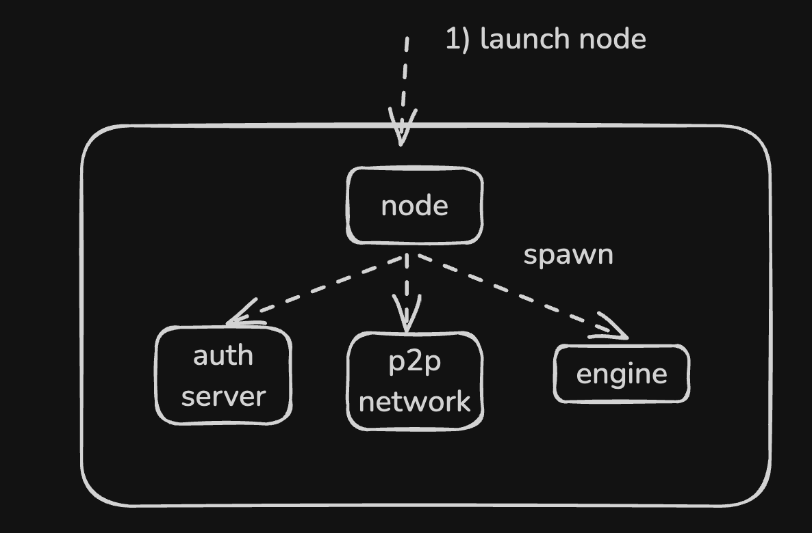
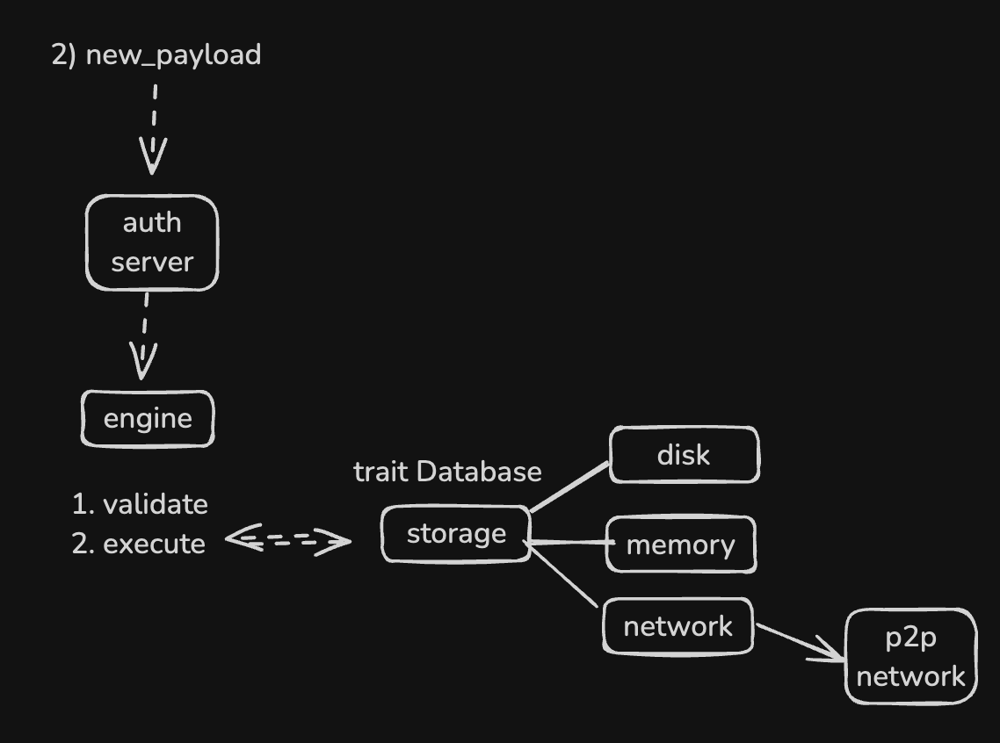
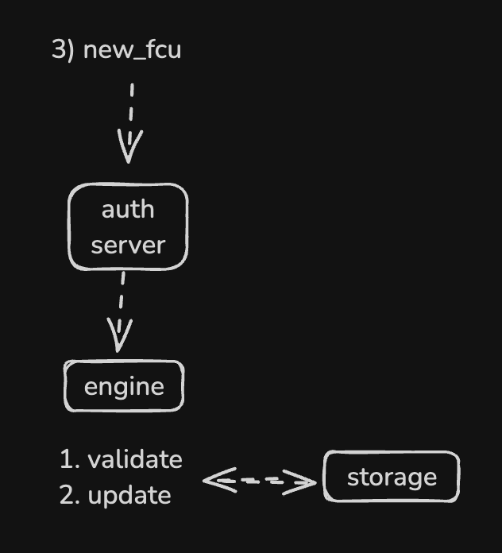

# ress(reth stateless)

## Poc seniaro

*note example payload generated from [here](https://github.com/Rjected/execution-payload-builder/tree/main)*

### 1. launch ress node

Spawning 3 process. 
- authserver: `EngineApi` implemented server to listen consensus message.
- p2p network: spawn network that implemented `ress-protocol`.
- engine: `ConsensusEngine` that spawned to keep receive message




### 2. new payload

Authserver received the message and validate payload scaleton. Send to `ConsensusEngine` and handle logic of further validation - against the parent header, construct Executor and run evm and post validation with receipt. 

Storage is abstracted in 3 different backend, disk, memory, network.




### 3. new fcu

validate message and update the state of node. 




## run
ress <> ress && reth(stateful reth) <> ress && reth <> reth (this is reth impl)(x)

- test_uils (peer1)
```console
RUST_LOG=info cargo run --bin ress 1
```

- test_uils (peer2)
```console
RUST_LOG=info cargo run --bin ress 2
```


## component

- binary
  - [reth](./bin/reth): run original reth client that added custom subprotocol to communicate with ress
  - [ress](./bin/ress): run resss client - stateless execution client

- crates
  - [ress-common](./crates/common): ress common 
  - [ress-network](./crates/network): provide functions to spawn authserver and network.
  - [ress-node](./crates/node): provide abstraction of launch the node and inner consensus engine implementation
  - [ress-storage](./crates/storage): provide abstraction of storage that handles 3 backends(disk,in memeory, network) base on request.
  - [ress-vm](./crates/vm): provide executor that can execute evm from new block
  - [subprotocol](./crates/subprotocol/)


