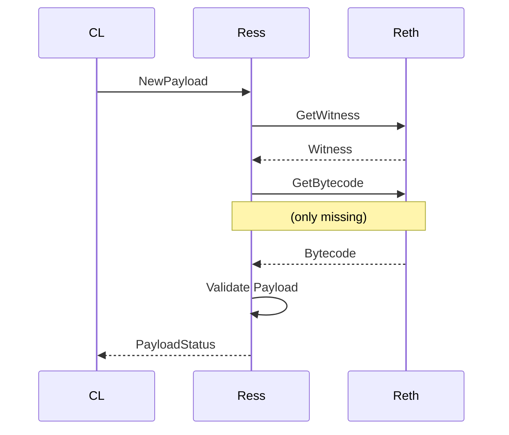
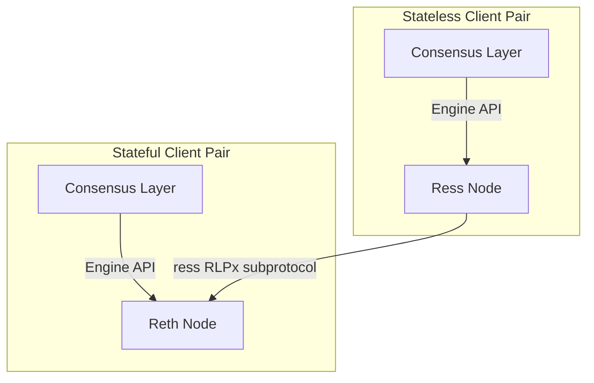

# ress(reth stateless)

Ress (shorthand for: Reth Stateless), a fully validating stateless Ethereum Execution Layer with 14GB disk requirements.
Stateless nodes matter not only for improving Ethereum’s decentralization, but also to scale the L1 gas limit,
scaling optimistic L2s, and for implementing Native Rollups to improve the L2 ecosystem’s security & interoperability.

> [!CAUTION]
> Ress is an experimental software that has not been fully tested in production grade settings.
> At this moment, we do not recommend using ress nodes in validator setups.

## Run

### Install

```bash
cargo install --git https://github.com/paradigmxyz/ress ress
```

### Run Consensus Layer client

See https://reth.rs/run/mainnet.html#running-the-consensus-layer for the instructions, they're the same as for Reth.

The only difference is that the default JWT token location is `~/.local/share/ress/NETWORK/jwt.hex`
instead of `~/.local/share/reth/NETWORK//jwt.hex`.

### (Optional) Run stateful Reth client

Follow the [instructions](https://reth.rs/run/run-a-node.html) to install Reth.
Start a node with the `--ress.enable` flag to enable support for `ress` subprotocol.

```bash
reth --ress.enable
```

### Run Ress client

We've hosted several public nodes that you can peer with if you don't have an ability to run a Reth node yourself.

```bash
ress --trusted-peers \
    enode://04bcda1f0a750ce5fd986187825ffcd7aa1ad3641027f646707c2121443e85ae309e047f228c0067aac382f0c0cab21e91a2852e10b4f7724187b0185bb78b2b@100.126.2.26:30303,\
    enode://04e4e548eee6f042685ad0b6793de36a4c5c6a3107cdf54cbfeedbeb0df4138d4c65b534fb700072341098644eb5a6b125e63c36464d8f57c19b6e26ca36ae7c@100.75.245.88:30303,\
    enode://2c464310c41c2a9d7be44783d38ab2b8517e4c5133719de1a4b605294cfd201f33b2c5b4158054b171a3ba26837f85a97f6a8553622ea1033d70c98fc1b70fa0@69.67.151.138:30303,\
    enode://065cffdc5c824d42c23f933ca615daad8b887f2330b1313e8c1a5d850be93d3b6e95698d4f774bbf7b2639ac6d6d870645156eeb805bd3448107806cc0a6e5f9@69.67.151.138:30303
```

If you've started a Reth node yourself in the previous step, you can fetch the enode from it
and use it as an argument to the `--trusted-peers` flag.
```bash
cast rpc admin_nodeInfo -r http://localhost:9545 | jq .enode
```

## How it works

Live sync works like any other stateful node: Ress receives a new payload from the consensus client
and fetches necessary state data (witness, block, bytecodes) from a stateful reth client
via [RLPx subprotocol dedicated to Ress](https://github.com/paradigmxyz/reth/tree/main/crates/ress/protocol).
It verifies payload and calculates the new state root all in memory.



### Components

To run a ress node successfully you need the following components:
1. Ress node (statless) connected to a Consensus Client
2. Reth node (stateful) connected to a Consensus Client



## How it was tested

### Hive Tests 

Ress was tested with [hive](https://github.com/ethereum/hive).
A simulator sends requests to `adapter`, which proxies `engine/*` request to `ress`, and other requests to `reth`. 

- `reth`: auth port(8651), rpc port(8544), subnetwork(30303)
- `ress`: auth port(8552), rpc port(-), subnetwork(61398)

We ran the cancun test suite and from the 226 tests, ress passes `206` hive tests successfully:
```
Mar 13 09:46:28.033 INF simulation ethereum/engine finished suites=1 tests=226 failed=20
```

### Holesky validators
For our proof of concept, we successfully [ran Ress-backed Ethereum validators](https://light-holesky.beaconcha.in/validator/1919380?v=attestations) on Holesky testnet and correctly attested to block validity.
